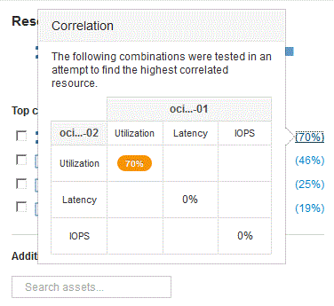

= Analisando recursos correlacionados
:allow-uri-read: 
:icons: font
:imagesdir: ../media/

[role="lead"]
Quando você está pesquisando problemas de desempenho e abre a página _Asset_ para um dispositivo, você deve usar a lista Top correlacionados Resources para refinar os dados exibidos nos gráficos de desempenho. Um recurso com uma porcentagem alta indica que o recurso tem atividade semelhante ao recurso base.

== Sobre esta tarefa

Você está investigando um problema de desempenho e abriu a página de ativos para um dispositivo.

== Passos

. Na lista *recursos correlacionados principais*, o primeiro recurso é o recurso base. Os recursos correlacionados na lista são classificados por porcentagem de atividade correlacionada ao primeiro dispositivo. Clique na porcentagem de correlação vinculada para ver os detalhes. Neste exemplo, a correlação de 70% está em utilização, de modo que tanto o recurso base quanto esse recurso correlacionado têm uma utilização igualmente alta.
+

. Para adicionar um recurso correlacionado aos gráficos de desempenho, marque a caixa de seleção na lista *principais recursos correlacionados* para o recurso que você deseja adicionar. Por padrão, cada recurso fornece o total de dados disponíveis, mas você pode selecionar somente ler ou somente gravar dados no menu na caixa de seleção.
+
Cada recurso nos gráficos tem uma cor diferente para que você possa comparar as medidas de desempenho para cada recurso. Apenas o tipo apropriado de dados é traçado para as métricas de medição selecionadas. Por exemplo, os dados da CPU não incluem métricas de leitura ou gravação, portanto, apenas os dados totais estão disponíveis.

. Clique no nome vinculado do recurso correlacionado para exibir sua página de ativo.
. Se você não vir um recurso listado nos principais recursos correlacionados que você acredita que deve ser considerado na análise, você pode usar a caixa *pesquisar ativos* para encontrar esse recurso.

