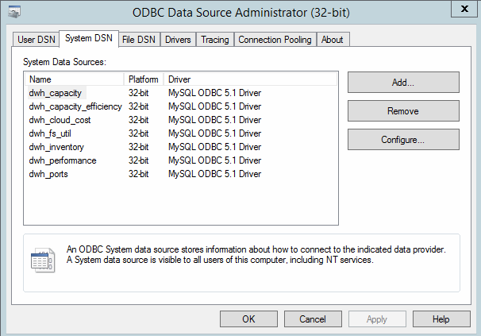

= Alterando a senha dwh usando a ferramenta Administração ODBC
:allow-uri-read: 
:icons: font
:imagesdir: ../media/

[role="lead"]
Quando alterar a palavra-passe para o utilizador dwh no servidor Insight, a palavra-passe também tem de ser alterada no servidor Data Warehouse. Você usa a ferramenta Administrador de origem de dados ODBC para alterar a senha no Data Warehouse.

== Antes de começar

Tem de efetuar um início de sessão remoto no servidor do Armazém de dados utilizando uma conta com o administrador Privileges.

== Passos

. Faça um login remoto no servidor que hospeda esse Data Warehouse.
. Acesse a ferramenta Administração ODBC em `C:\Windows\SysWOW64\odbcad32.exe`
+
O sistema exibe a tela Administrador da fonte de dados ODBC.

+
image::../media/odbc.gif[odbc]

. Clique em *System DSN*
+
São apresentadas as fontes de dados do sistema.

+

. Selecione uma fonte de dados OnCommand Insight na lista.
. Clique em *Configurar*
+
É apresentado o ecrã Data Source Configuration (Configuração da fonte de dados).

+
image::../media/data-source-password.gif[palavra-passe da fonte de dados]

. Introduza a nova palavra-passe no campo *Palavra-passe*.

