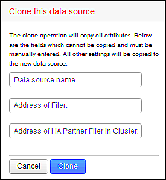

= Clonar uma fonte de dados
:allow-uri-read: 
:icons: font
:imagesdir: ../media/

[role="lead"]
Usando a instalação de clone, você pode adicionar rapidamente uma fonte de dados com as mesmas credenciais e atributos de outra fonte de dados. A clonagem permite configurar facilmente várias instâncias do mesmo tipo de dispositivo.

== Passos

. Na barra de ferramentas Insight, clique em *Admin*.
+
A lista Data Sources (fontes de dados) é aberta.

. Realce a fonte de dados que tem as informações de configuração que você deseja usar para sua nova fonte de dados.
. À direita da fonte de dados realçada, clique no ícone *Clone*.
+
A caixa de diálogo clonar esta fonte de dados lista as informações que você deve fornecer para a fonte de dados selecionada, como mostrado neste exemplo para uma fonte de dados NetApp:

+

. Insira as informações necessárias nos campos; esses detalhes não podem ser copiados da fonte de dados existente.
. Clique em *Clone*.

== Resultados

A operação clone copia todos os outros atributos e configurações para criar a nova fonte de dados.
