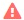

= Determinando o status de aquisição da fonte de dados
:allow-uri-read: 
:icons: font
:imagesdir: ../media/

[role="lead"]
Como as fontes de dados são a principal fonte de informações do Insight, é essencial garantir que elas permaneçam em um estado em execução.

A capacidade de ver o status de aquisição da fonte de dados está disponível em todas as páginas de ativos para todos os ativos adquiridos diretamente. Qualquer um dos cenários de aquisição a seguir pode ocorrer, em que o status é exibido no canto superior direito da página de ativos:

* Adquirido com êxito a partir da fonte de dados
+
Exibe o status "'Acquired indica `xxxx``", where `xxxx` o tempo de aquisição mais recente das fontes de dados do ativo.

* Existe um erro de aquisição.
+
Exibe o status "'Acquired indica `xxxx``", where `xxxx` o tempo de aquisição mais recente de uma ou mais fontes de dados do ativo com o . Quando você clica em , uma janela exibe cada fonte de dados para o ativo, o status da fonte de dados e a última vez que os dados foram adquiridos. Clicar em uma fonte de dados exibe a página de detalhes da fonte de dados.

Se um ativo não for adquirido diretamente, nenhum status será exibido.
