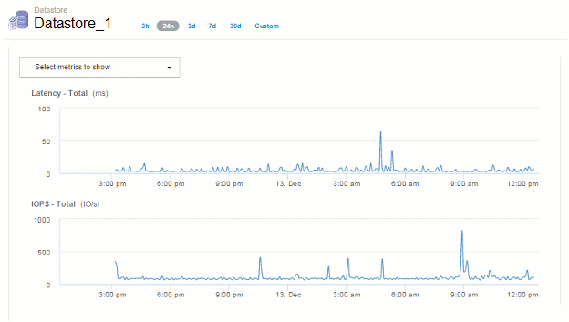

= Time-to-live (TTL) e downsampled dados
:allow-uri-read: 
:icons: font
:imagesdir: ../media/

[role="lead"]
A partir do OnCommand Insight 7,3, a retenção de dados ou o tempo de vida (TTL) aumentou para de 7 para 90 dias. Como isso significa que muito mais dados são processados para gráficos e tabelas e o potencial para dezenas de milhares de datapoints, os dados são reduzidos antes de serem exibidos.

O downsampling fornece uma aproximação estatística de seus dados em gráficos, proporcionando uma visão geral eficiente dos dados sem ter que exibir todos os pontos de dados, mantendo uma visão precisa dos dados coletados.

== Por que é necessário fazer downsampling?

Insight 7,3 aumenta o tempo de vida (TTL) para dados para 90 dias. Isso significa um aumento na quantidade de processamento necessária para preparar dados para exibição em gráficos e gráficos. Para permitir que gráficos sejam exibidos de forma rápida e eficiente, os dados são reduzidos de uma forma que mantém a forma geral de um gráfico sem a necessidade de processar cada ponto de dados para esse gráfico.

[NOTE]
====
Nenhum dado real é perdido durante a downsampling. Você pode optar por exibir dados reais para o seu gráfico em vez de dados downsampled seguindo as etapas ilustradas abaixo.

====

== Como funciona o downsampling

Os dados são reduzidos nas seguintes condições:

* Quando o intervalo de tempo selecionado incluir 7 dias de dados ou menos, não ocorre uma redução de amostragem. Os gráficos exibem dados reais.
* Quando o intervalo de tempo selecionado inclui mais de 7 dias de dados, mas menos de 1.000 pontos de dados, não ocorre uma redução de amostragem. Os gráficos exibem dados reais.
* Quando o intervalo de tempo selecionado incluir mais de 7 dias de dados e mais de 1.000 pontos de dados, os dados são reduzidos. Os gráficos exibem dados aproximados.

Os exemplos a seguir mostram downsampling em ação. A primeira ilustração mostra gráficos de latência e IOPS em uma página de ativos do datastore por um período de 24 horas, como mostrado selecionando *24h* no seletor de tempo da página de ativos. Você também pode ver os mesmos dados selecionando *Custom* e definindo o intervalo de tempo para o mesmo período de 24 horas.

Como estamos escolhendo um intervalo de tempo inferior a 7 dias e temos menos de 1.000 pontos de dados para o gráfico, os dados exibidos são dados reais. Não ocorre uma amostragem descendente.

No entanto, se você estiver visualizando dados escolhendo *30d* no seletor de tempo da página de ativos ou definindo um intervalo de tempo personalizado de mais de 7 dias (ou no caso de o Insight ter coletado mais de 1.000 amostras de dados para o período de tempo escolhido), os dados serão reduzidos antes de serem exibidos. Quando você amplia um gráfico de redução, o visor continua a mostrar os dados aproximados.

[NOTE]
====
Quando você faz zoom em um gráfico de redução, o zoom é um zoom digital. O visor continua a mostrar os dados aproximados.

====
Você pode ver isso na ilustração a seguir, onde o intervalo de tempo é definido primeiro para 30d, e o gráfico é então ampliado para mostrar o mesmo período de 24 horas como acima.

image::../media/downsampling-downsampled-chart.gif[downsampling downsampled chart]

Os gráficos downsampled estão mostrando o mesmo período de 24 horas que os gráficos "reais" acima, de modo que as linhas seguem a mesma forma geral, permitindo que você rapidamente detetar picos ou vales interessantes em seus dados de desempenho.

[NOTE]
====
Devido à forma como os dados são aproximados para downsampling, as linhas do gráfico podem estar ligeiramente desconetadas ao comparar dados downsampled vs. Reais, para permitir um melhor alinhamento nos gráficos. No entanto, a diferença é mínima e não afeta a precisão geral dos dados exibidos.

====

== Violações em gráficos downsampled

Ao visualizar gráficos downsampled, esteja ciente de que as violações não são mostradas. Para ver violações, você pode fazer uma de duas coisas:

* Visualize os dados reais desse intervalo de tempo selecionando Personalizar no seletor de tempo da página de ativos e inserindo um intervalo de tempo inferior a 7 dias. Passe o Mouse sobre cada ponto vermelho. A dica de ferramenta mostrará a violação que ocorreu.
* Observe o intervalo de tempo e encontre a(s) violação(ões) no Painel de violação.

