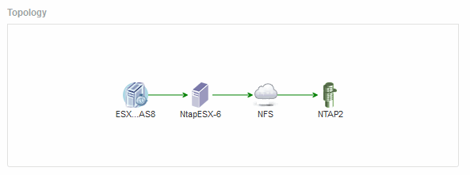

= Topologia
:allow-uri-read: 
:icons: font
:imagesdir: ../media/

[role="lead"]
A seção topologia, se aplicável a um ativo, permite que você veja como um ativo base está conetado aos seus ativos relacionados.

A seguir mostra um exemplo do que pode ser exibido na seção topologia de uma página de ativos de máquina virtual.

Se a topologia do ativo for maior do que caberá na seção, o link *clique para ver o hiperlink topologia* será exibido.
