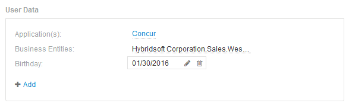

= Dados do usuário
:allow-uri-read: 
:icons: font
:imagesdir: ../media/

[role="lead"]
A seção dados do usuário de uma página de ativo exibe e permite que você altere quaisquer dados definidos pelo usuário, como aplicativos, entidades comerciais e anotações.

A seguir mostra um exemplo do que pode ser exibido na seção dados do usuário de uma página de ativos de máquina virtual quando um aplicativo, entidade de negócios e anotação são atribuídos ao ativo:

