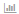

= Usando a seção ativos relacionados
:allow-uri-read: 
:icons: font
:imagesdir: ../media/

[role="lead"]
A seção ativos relacionados permite que você visualize qualquer um dos ativos relacionados ao ativo base. Cada ativo relacionado é exibido em uma tabela juntamente com as estatísticas pertinentes para o ativo. Você pode exportar as informações do ativo, exibir as estatísticas do ativo nos gráficos de desempenho do Expert View ou mostrar um gráfico que exibe estatísticas apenas para ativos relacionados.

== Passos

. Faça login na IU da Web do OnCommand Insight.
. Localize uma página de ativo fazendo uma das seguintes opções:
+
** Na barra de ferramentas do Insight, clique image:../media/icon-sanscreen-magnifying-glass-gif.gif[""]em , digite o nome do ativo e selecione-o na lista.
** Clique em *painéis*, selecione *Painel de ativos*, localize um nome de ativo e clique nele. A página de ativos é exibida.

. Para controlar como os ativos são exibidos na tabela:
+
** Clique no nome de qualquer ativo para exibir sua página de ativo.
** Use a caixa *filter* para mostrar somente ativos específicos.
** Clique em um número de página para navegar pelos ativos por página se houver mais de cinco ativos na tabela.
** Altere a ordem de classificação das colunas de uma tabela para ascendente (seta para cima) ou descendente (seta para baixo) clicando na seta no cabeçalho da coluna.
** Adicione um ativo relacionado a qualquer gráfico de desempenho na seção Expert View colocando o cursor sobre o ativo relacionado e clicando image:../media/add-to-expert-view-graph.gif[""]em .

. Para exportar as informações exibidas na tabela para um `.CSV` arquivo:
+
.. Clique image:../media/export-to-csv.gif[""]em .
.. Clique em *abrir com* e em *OK* para abrir o ficheiro com o Microsoft Excel e guardar o ficheiro num local específico ou clique em *Guardar ficheiro* e, em seguida, em *OK* para guardar o ficheiro na pasta Transferências.
+
Todos os atributos de objeto para as colunas selecionadas atualmente para exibição são exportados para o arquivo. Apenas os atributos para as colunas exibidas serão exportados. Observe que somente as primeiras 10.000 linhas da tabela são exportadas.

. Para exibir as informações de ativos relacionados em um gráfico abaixo da tabela, clique  em e execute qualquer um dos seguintes procedimentos:
+
** Clique em *Read*,*Write* ou *Total* para alterar os dados métricos exibidos. *Total* é o padrão.
** Clique image:../media/pencil-icon-landing-page-be.gif[""] para selecionar uma métrica diferente.
** Clique image:../media/change-chart-type-icon.gif[""] para alterar o tipo de gráfico. *Gráfico de linha* é o padrão.
** Mova o cursor sobre os pontos de dados no gráfico para ver como o valor da métrica muda ao longo do período de tempo selecionado para cada ativo relacionado.
** Clique em um ativo relacionado na legenda do gráfico para adicioná-lo ou removê-lo do gráfico.
** Clique em um número de página na tabela de ativos relacionados para exibir outros ativos relacionados no gráfico.
** Clique  para fechar o gráfico.

