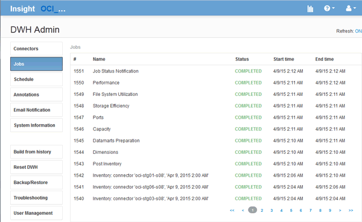

= Gerir trabalhos
:allow-uri-read: 
:icons: font
:imagesdir: ../media/

[role="lead"]
Pode ver uma lista de trabalhos atuais e o respetivo estado. O primeiro trabalho em um ciclo de compilação está em negrito. A compilação que o Data Warehouse executa para cada conetor e para cada data mart é considerada um trabalho.

== Sobre esta tarefa

Você pode cancelar qualquer trabalho pendente que tenha agendado ou iniciado. Também pode limpar o histórico de trabalhos executados anteriormente. Você pode limpar o histórico de tarefas que não estão pendentes, em execução ou no processo de abortar. Você pode limpar todo o histórico ou todo o histórico, exceto as 24 horas anteriores, para remover todas as entradas do último dia, exceto as do último dia.

Você pode ver informações sobre os seguintes tipos de trabalhos: Licença, Pré-inventário, Inventário, Pós-inventário, dimensões, preparação de DataMarts, capacidade, portas, eficiência de armazenamento, utilização do sistema de arquivos, desempenho, notificação de status do trabalho, compilação de histórico, anotações dinâmicas, remoção de conetores, compilação ignorada, Home do telefone e manutenção.

Um trabalho de manutenção é executado semanalmente e usa ferramentas MySQL para otimizar o banco de dados.

== Passos

. Faça login no Portal do Armazém de dados em `+https://hostname/dwh+`, onde `hostname` está o nome do sistema onde o Armazém de dados OnCommand Insight está instalado.
. No painel de navegação à esquerda, clique em *trabalhos*.
+

+
Se um status pendente for exibido, um link de cancelamento será exibido.

. Para cancelar um trabalho pendente, clique em *cancelar*.
. Para remover o histórico de trabalhos, clique em *All* ou *All but last 24h*.

