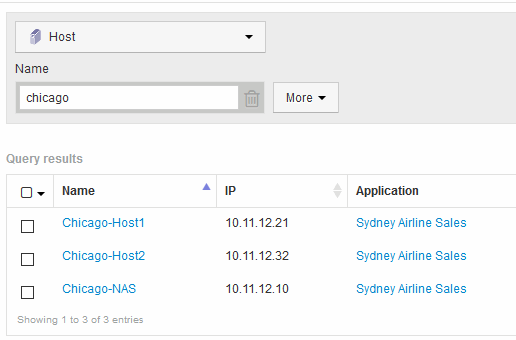

= Atribuindo aplicativos a um ativo usando uma consulta
:allow-uri-read: 
:icons: font
:imagesdir: ../media/

[role="lead"]
Você atribui um aplicativo a um ativo para que possa identificar os recursos do ativo que o aplicativo usa. Se um ativo tem um custo atribuído a ele, você pode identificar o custo que é incorrido pelo aplicativo e se o recurso é medido por tamanho, você pode determinar se o recurso precisará ser reabastecido.

== Sobre esta tarefa

Você pode simplificar a tarefa de atribuir vários ativos a um aplicativo usando uma consulta.

== Passos

. Crie uma nova consulta para identificar os ativos aos quais você deseja atribuir um aplicativo. Por exemplo, se você quiser atribuí-lo a um host com um nome específico relacionado a uma localização geográfica, clique em *consultas* > Nova consulta*
. Clique em *Host*
. No campo *Nome*, insira `Chicago`
+
O sistema exibe todos os hosts com `Chicago` como parte se o nome deles. 

. Selecione um ou mais hosts identificados por sua consulta.
. Clique em *ações* > *Adicionar aplicativo*
+
image::../media/application-assign.gif[atribuir aplicação]

+
O sistema exibe a caixa de diálogo atribuir aplicativo.

. Selecione a aplicação que pretende atribuir ao anfitrião e clique em image:../media/check-box-ok.gif[""]
. Clique em *Salvar*
+
O nome da aplicação é apresentado na secção dados do utilizador.

