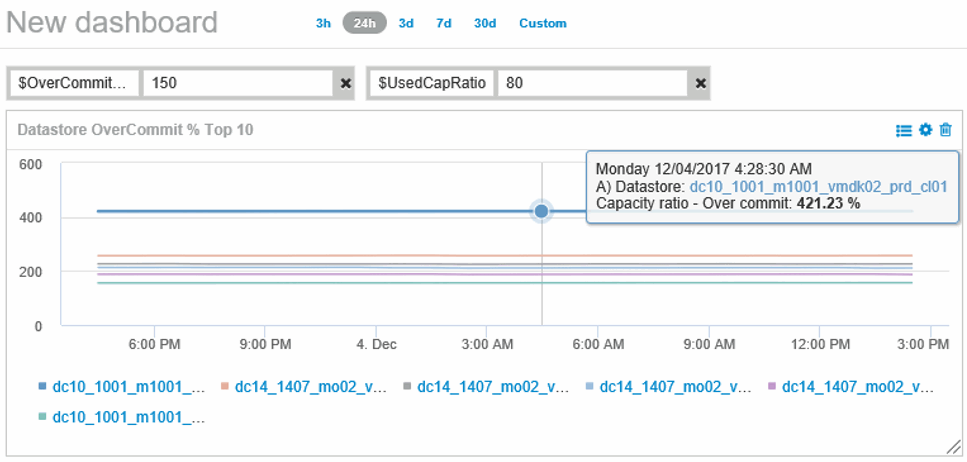
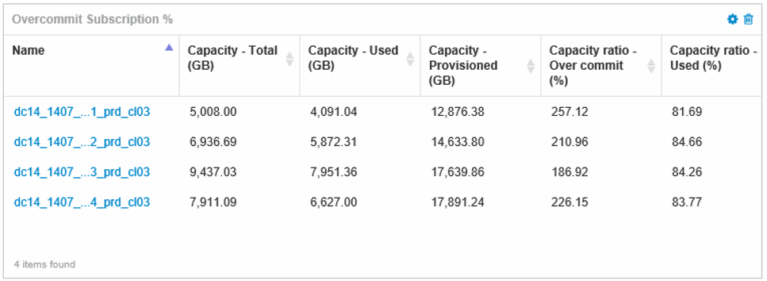

= Crie painéis para monitorar ambientes com thin Provisioning
:allow-uri-read: 
:icons: font
:imagesdir: ../media/

[role="lead"]
As opções flexíveis de design de widgets do dashboard e gráficos de exibição do OnCommand Insight permitem uma análise profunda do uso e utilização da capacidade, informações estratégicas para minimizar riscos em infraestruturas de data center com provisionamento reduzido.

Você pode criar painéis que fornecem acesso às informações do datastore e do pool de armazenamento que deseja monitorar.

== Usando painéis para acessar informações do datastore

Você pode querer criar painéis que fornecem acesso rápido aos dados que deseja monitorar em sua infraestrutura virtual. Um dashboard pode incluir widgets semelhantes aos seguintes para identificar os 10 principais datastores com base em sua % sobrecomprometida e um widget mostrando os dados de capacidade para datastores. Os dashboards usam variáveis para destacar armazenamentos de dados que estão sobrecomprometidos em mais de 150% e armazenamentos de dados que excederam mais de 80% da capacidade utilizada.

Widgets adicionais que podem ser usados para monitorar seu ambiente thin-provisionado podem incluir algumas das seguintes informações:

* Capacidades do VMDK correlacionadas aos datastores
* Capacidades de VM
* Capacidade de armazenamento de dados usada em tendências

== Usando painéis para acessar as informações do pool de armazenamento

Um painel pode incluir widgets semelhantes aos seguintes, identificando a quantidade de capacidade de armazenamento físico usada ou identificando a capacidade sobrecomprometida de um pool de armazenamento.

image::../media/aggr3c64.gif[aggr3c64]
