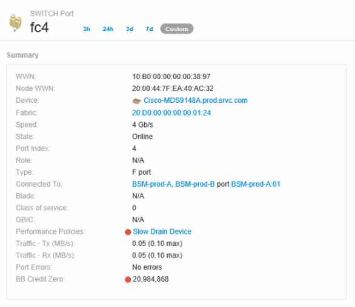

= Criação de políticas de desempenho e limites para portas
:allow-uri-read: 
:icons: font
:imagesdir: ../media/

[role="lead"]
Você pode criar políticas de desempenho com limites para métricas associadas a uma porta. Por padrão, as políticas de desempenho se aplicam a todos os dispositivos do tipo especificado quando você os cria. Pode criar uma anotação para incluir apenas um dispositivo específico ou um conjunto de dispositivos na política de desempenho. Para simplificar, não é utilizada uma anotação neste procedimento.

== Antes de começar

Se pretender utilizar uma anotação com esta política de desempenho, tem de criar a anotação antes de criar a política de desempenho.

== Passos

. Na barra de ferramentas Insight, clique em *Manage* > *Performance Policies*
+
As políticas existentes são exibidas. Se houver uma política para portas de switch, você poderá editar a política existente, adicionando as novas políticas e limites.

. Edite uma política de portas existente ou crie uma nova política de portas
+
** Clique no ícone de lápis à direita da política existente. Acrescentar os limiares descritos nos passos "d" e "e".
** Clique em Adicionar* para adicionar uma nova política
+
... Adicione um "'Nome da Política'": Dispositivo de drenagem lenta
... Selecione porta como tipo de objeto
... Introduza a primeira ocorrência para "aplicar depois da janela" de
... Introduzir limite: BB crédito zero - Rx > 1.000.000
... Introduzir limite: BB crédito zero - TX > 1.000.000
... Clique em "'Parar processamento de outras políticas se o alerta for gerado'"
... Clique em "Salvar"

+
A política criada monitora os limites definidos por você durante um período de 24 horas. Se o limite for excedido, uma violação é relatada.

. Clique em *painéis* > *Painel de violações*
+
O sistema exibe todas as violações que ocorreram no sistema. PESQUISE ou classifique as violações para ver as violações do ""dispositivo de drenagem lenta"". O Painel de violações mostra todas as portas com erros BB Credit 0 excedendo os limites definidos na política de desempenho. Cada porta do switch identificada no painel violações é um link destacado para a página de destino da porta.

. Clique em um link de porta destacado para exibir a página de destino da porta.
+
A página de destino da porta é exibida e inclui informações úteis para a solução de problemas do BB Credit 0:

+
** Dispositivos aos quais a porta está ligada
** Identificação da porta que relata a violação, que é uma porta de switch de canal de fibra.
** A velocidade da porta
** O nó e o nome da porta associados 

. Role para baixo para ver as métricas da porta. Clique em *Select metrics to show* > *BB credit zero* para exibir o gráfico de crédito BB.
+
image::../media/expert-port-metrics.gif[métricas de porta especializadas]

. Clique em *Top correlacionado*
+
A principal análise de recursos correlacionados mostra o nó do controlador conetado que a porta está atendendo como o recurso mais correlacionado com o desempenho. Esta etapa compara as métricas de IOPS da atividade da porta com a atividade geral dos nós. As exibições mostram as métricas TX e Rx BB Credit Zero e o IOPS do nó do controlador. O visor apresenta o seguinte:

+
** O controlador iOS está altamente correlacionado com o tráfego da porta
** A política de desempenho é violada quando a porta está transmitindo IO para o servidor.
** Dado que nossa violação de desempenho de porta está ocorrendo em conjunto com uma carga de IOPS alta no controlador de armazenamento, é provável que a violação seja devido à carga de trabalho no nó de armazenamento. image:../media/port-node-compare.gif[""]

. Retorne à página de destino da porta e acesse a página de destino do nó do controlador de storage para analisar as métricas da carga de trabalho.
+
O nó mostra uma violação de utilização e as métricas mostram "leituras de cache substituídas" elevadas que se correlacionam com os estados de crédito zero de buffer a buffer.

+
image::../media/node-landing-page.gif[página inicial do nó]

. Na página inicial do nó, você pode comparar os zeros de crédito BB selecionando a porta na lista recursos correlacionados e selecionar dados de utilização, incluindo dados de utilização do cache, para o nosso nó no menu métricas.
+
image::../media/node-port-comparison.gif[comparação de portas do nó]

+
Esses dados deixam claro que a taxa de acerto do cache está inversamente correlacionada com nossas outras métricas. Em vez de ser capaz de responder à carga do servidor a partir do cache, o nó de armazenamento está passando por leituras de cache alto substituídas. É provável que ter que recuperar a maioria dos dados do disco em vez de cache esteja causando o atraso na transmissão de dados da porta para o servidor. A causa do problema de desempenho parece ser uma alteração gerada pela carga de trabalho no comportamento de e/S e que o cache do nó e sua configuração são a causa. O problema pode ser resolvido aumentando o tamanho do cache do nó ou alterando o comportamento do algoritmo de cache.

