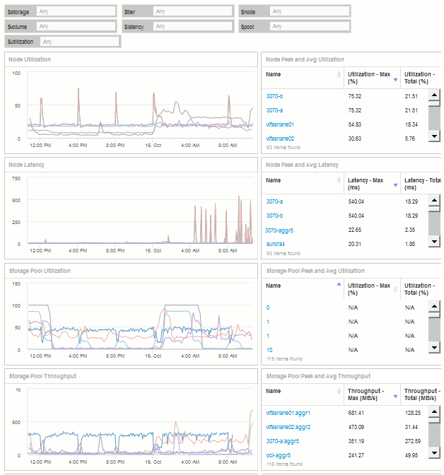

= Exemplo de dashboard de utilização do nó de storage com variáveis
:allow-uri-read: 
:icons: font
:imagesdir: ../media/

[role="lead"]
Crie um dashboard personalizado para análise de storage que tenha variáveis de storage, pool de storage, nó, camada, utilização e latência.

== Antes de começar

A familiaridade com painéis no Insight é recomendada, mas não é necessária.

== Sobre esta tarefa

O procedimento a seguir criará um painel de visão geral de análise de armazenamento personalizado que usa variáveis para armazenamento, pool de armazenamento, nó, camada, utilização e latência. As variáveis no exemplo abaixo serão usadas para filtrar os ativos ou métricas exibidos em um ou vários widgets disponíveis no painel. Os widgets que usam essas variáveis como filtros serão atualizados com conteúdo filtrado sob demanda de acordo com os valores inseridos nos campos variáveis no painel, permitindo que você filtre rapidamente vários gráficos e gráficos para detalhar uma área específica de interesse.

Seguindo as etapas deste exemplo, você criará um painel como o seguinte. Você pode alterar esses widgets ou adicionar qualquer número de widgets adicionais para destacar os dados que você escolher.

== Passos

. Crie um novo dashboard e nomeie-o como "análise: Visão geral do armazenamento", ou algo igualmente descritivo.
. Clique na lista suspensa *variável* e selecione *texto* tipo de variável. Por padrão, a variável é chamada _ var1_. Clique em _ USD var1_ para editar o nome e altere-o para _ USD storage_ e, em seguida, clique na marca de seleção para salvar a variável. Repita para criar variáveis de texto para _ node_, _ pool_ e _ volume_.
. Repita o processo acima para criar variáveis do tipo *number* chamadas _ usage_ e _ Latency_.
. Clique na lista suspensa *Variable* e procure a anotação _Tier_. Selecione-a para criar uma variável chamada _ Tier_.
+
Você pode adicionar variáveis a qualquer momento, no entanto, é mais fácil criá-las na frente e, portanto, torná-las disponíveis para todos os widgets enquanto você as cria.

. Adicione um widget clicando no menu suspenso *Widget* e selecionando um ** gráfico de linhas ou *gráfico de área* widget. Nomeie o widget ""utilização do nó"". Clique no tipo de ativo *Storage* e altere-o para *Storage Node*. Selecione *utilização - Total* para os dados do gráfico.
. Clique no botão *Filtrar por* para adicionar um filtro. Procure e selecione *Storage*, depois clique em *any* e selecione a variável _ storage_.
. Clique no botão** para adicionar outro filtro para *Nome*. Defina a variável como _ node_.
+
Diferentes variáveis podem ser atribuídas ao filtro de nome da anotação. Use o par nome/variável no nível mais baixo, dependendo do objeto no widget. Por exemplo:

+
** Você pode atribuir a variável _ node_ ao filtro *Name* para um widget com foco no nó.
** Você pode atribuir a variável _ pool_ ao filtro *Name* para um widget focado em pool.

. Clique no botão** para adicionar outro filtro para *utilização - total (%)*. Defina a variável como _>
. Clique no *X* após o campo**Roll up** para recolher o campo.
. Selecione *Mostrar Top 5* e clique em *Salvar* para salvar o widget e retornar ao seu Dashboard.
+
Seu widget deve se parecer com isso:

+
image::../media/widget-node-util-1.gif[widget node útil 1]

. Adicione outro widget de gráfico de linha ou área ao seu painel. Selecione *nó de armazenamento* como o tipo de ativo e *latência - total* como a métrica para o gráfico.
. Clique no botão *Filtrar por* para adicionar filtros para *armazenamento: Armazenamento* e *Nome: Nó*.
. Adicione um filtro para *latência - total* e selecione a variável * latência*.
. Nomeie o widget "'latência do nó"" e salve-o.
. Você pode adicionar tabelas de suporte para mostrar mais detalhes para os gráficos criados, por exemplo, utilização de nó máximo ou médio. Adicione um widget *Tabela* ao painel e selecione *nó de armazenamento* como o tipo de ativo e crie filtros para *armazenamento:
. Adicione colunas à tabela para *utilização - Máx*, *utilização - Total* ou qualquer outra coluna desejada.
. Nomeie o widget ""Pico do nó e utilização média"" e salve-o.
+
image::../media/nodeutiltablesettings.gif[nodeutiltablesettings]

. Repita as etapas para criar uma tabela para latência do nó, mostrando *latência - máx*, *latência - total* ou outras colunas conforme desejado.
. Para completar o seu painel, você pode adicionar widgets de tabela e gráfico adicionais para alguns ou todos os seguintes itens:

|===

| Gráfico | Tabela 

 a| 
Utilização do pool de storage
 a| 
Pico do pool de storage e utilização média

 a| 
Taxa de transferência do pool de storage
 a| 
Taxa de transferência de pico e média do pool de armazenamento

 a| 
Latência de volume
 a| 
Pico de volume e latência média

 a| 
IOPS do volume
 a| 
Pico de volume e IOPS médio

|===
. Você pode mover e redimensionar os widgets em qualquer lugar que você quiser em seu painel. Quando terminar, certifique-se de *Salvar* o painel.
+
Seu painel final será parecido com isso:

+

. Você pode usar as variáveis para se concentrar em ativos específicos em seu painel. À medida que você insere valores nos campos variáveis, seus widgets são atualizados automaticamente para refletir essas variáveis. Por exemplo, ao inserir "'15'" no campo da variável de utilização de USD, os widgets que usam essa variável atualizam para mostrar apenas ativos com utilização total > 15%.
+
Widget de utilização do nó mostrando os 5 principais de todos os nós:

+
image::../media/nodeutil-unfiltered.gif[nodeutil não filtrado]

+
Widget de utilização do nó mostrando nós com utilização igual ou superior a 15%:

+
image::../media/nodeutil-filtered.gif[nodeutil filtrado]

. Tenha em mente o seguinte ao criar seus widgets:
+
** A variável de nível USD impactará apenas os recursos anotados com a anotação *Tier*.
** Nem todos os filtros afetarão todos os widgets, dependendo se o widget foi projetado para aceitar a(s) variável(s) especificada(s).
** As variáveis numéricas são aplicadas como "maior ou igual a" o valor especificado. Observe que qualquer variável pode ser usada como um filtro em qualquer widget em qualquer nível em uma hierarquia de armazenamento, desde que a variável seja válida para o ativo contra o qual o widget está sendo executado. À medida que você desce de um nível de nó para um pool de armazenamento para um widget de volume, mais variáveis estão presentes para atribuição como filtros. Por exemplo, em um widget de nível de nó de armazenamento, as variáveis _Storage_ e _Name_ podem ser atribuídas como filtros. Em um nível de pool de storage, _Storage_, _nodes_, _Storage Pools_ e _Name_ estão todos disponíveis. Atribua suas variáveis conforme apropriado e use a variável Nome USD no nível mais baixo da pilha. Isso permitirá que sua variável de nome USD filtre o nome real do ativo em que o widget está sendo executado.

