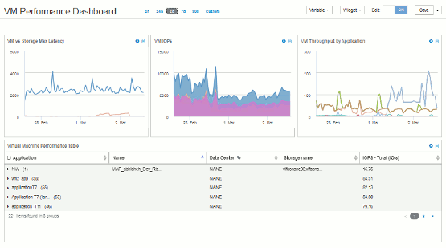

= Painel personalizado: Desempenho da máquina virtual
:allow-uri-read: 
:icons: font
:imagesdir: ../media/

[role="lead"]
Os painéis e widgets personalizados do OnCommand Insight ajudam a fornecer visualizações operacionais sobre tendências de inventário e desempenho.

== Sobre esta tarefa

Atualmente, existem muitos desafios que as operações DE TI enfrentam. Os administradores precisam fazer mais com menos, e é preciso ter visibilidade total dos data centers dinâmicos. Neste exemplo, mostraremos como criar um painel personalizado com widgets que fornecem informações operacionais sobre o desempenho da máquina virtual em seu ambiente. Ao seguir este exemplo e criar widgets para atender às suas próprias necessidades específicas, você poderá visualizar o desempenho de armazenamento de back-end em comparação com o desempenho da máquina virtual (VM) frontend ou visualizar a latência da VM em relação à demanda de e/S.

Painéis personalizados permitem priorizar esforços e identificar a disponibilidade de recursos. Você pode responder ao refluxo e ao fluxo de workloads e minimizar o tempo de detectar e corrigir novos problemas. Os painéis personalizados permitem a flexibilidade de criar visualizações priorizadas para a infraestrutura essencial aos negócios e são úteis para identificar a disponibilidade de desempenho em tecnologias de vários fornecedores.

Aqui vamos criar um painel de desempenho de máquina virtual contendo o seguinte:

* Uma tabela que lista nomes de VMs e dados de performance
* Um gráfico comparando a latência da VM com a latência do storage
* Um gráfico mostrando leitura, gravação e IOPS total para VMs
* Um gráfico mostrando a taxa máxima de transferência para suas VMs

Este é apenas um exemplo básico. Você pode personalizar seu painel para destacar e comparar os dados de desempenho que escolher para segmentar para suas próprias práticas recomendadas operacionais.

== Passos

. Faça login no Insight como um usuário com permissões administrativas.
. No menu *Dashboards*, selecione * novo painel*.
+
Abre-se a página novo painel.

. Vamos dar ao nosso painel um nome significativo. Clique em *Salvar*. No campo *Nome*, insira um nome exclusivo para o painel, por exemplo ""desempenho de VM por aplicativo"".
. Clique em *Salvar* para salvar o painel com o novo nome.
. Vamos começar a adicionar nossos widgets. Se necessário, deslize o botão *Edit* para "'On'" para ativar o modo Edit.
. Clique no botão *Widget* e selecione *widget Tabela* para adicionar um novo widget de tabela ao painel.
+
A caixa de diálogo Editar widget é aberta. O nome padrão é "Widget 1" e os dados padrão exibidos são para todos os armazenamentos em seu ambiente.

+
image::../media/customdash-vm-table-1.gif[tabela de vm customdash 1]

. Podemos personalizar este widget. No campo Nome, exclua ""Widget 1"" e digite ""Tabela de desempenho da Máquina Virtual"".
. Clique no menu suspenso tipo de ativo e altere *Storage* para *Virtual Machine*.
+
Os dados da tabela são alterados para mostrar todas as máquinas virtuais em seu ambiente. Por enquanto, a tabela mostra apenas os nomes da VM. Vamos adicionar algumas colunas à tabela.

. Clique no botão *colunas*image:../media/column-picker-button.gif[""] e selecione _Centro de dados_, _Nome do armazenamento_ e _IOPS - Total_. Você também pode tentar digitar o nome na pesquisa para exibir rapidamente o(s) campo(s) desejado(s).
+
Estas colunas são agora apresentadas na tabela. Você pode classificar a tabela por qualquer uma dessas colunas. Observe que as colunas são exibidas na ordem em que foram adicionadas ao widget.

. Para este exercício, excluiremos VMs que não estão ativamente em uso, então vamos filtrar qualquer coisa com menos de 10 IOPS totais. Clique no botão "Filtrar por" e selecione__IOPS - Total (IO/s)__. Clique em *any* e insira "'10" no campo *de*. Deixe o campo *to* vazio. Clique no image:../media/check-box-ok.gif[""] botão para guardar o filtro.
+
A tabela agora mostra apenas VMs com 10 ou mais IOPS total.

. Podemos recolher ainda mais a tabela agrupando os resultados. Clique no botão "agrupar por" ao lado de *Agrupar por* e selecione um campo para agrupar por, como aplicativo ou cluster. O agrupamento é aplicado automaticamente.
+
As linhas da tabela são agora agrupadas de acordo com sua configuração. Você pode expandir e recolher os grupos conforme necessário. As linhas agrupadas mostram dados agrupados para cada uma das colunas. Algumas colunas permitem que você escolha o método de rolagem para essa coluna.

+
image::../media/custom-dashboard-editwidget-table-populated-5-5.png[tabela de editwidget de dashboard personalizada preenchida 5 5]

. Quando você tiver personalizado o widget da tabela para sua satisfação, clique no botão *Salvar*.
+
O widget da tabela é salvo no painel.

. Você pode redimensionar o widget no painel arrastando o canto inferior direito. Torne o widget mais amplo para mostrar todas as colunas claramente. Clique em *Salvar* para salvar o painel atual.
. Em seguida, vamos adicionar alguns gráficos para mostrar nosso desempenho de VM. Vamos criar um gráfico de linha comparando a latência da VM com a latência do storage.
. Se necessário, deslize o botão *Edit* para "'On'" para ativar o modo Edit.
. Clique no botão *Widget* e selecione *Gráfico de linha* para adicionar um novo widget de gráfico de linha ao painel.
+
A caixa de diálogo Editar widget é aberta. Clique no campo *Name* e nomeie este widget "'VM vs Storage Max Latency'"

. Selecione *Virtual Machine* e escolha *Latency - Max*. Defina os filtros que desejar ou deixe *Filtrar por* vazio. Para *Roll up*, escolha "soma" por "tudo". Exiba esses dados como um Gráfico de linha** e deixe o eixo Y como *primário*.
. Clique no botão * Adicionar * para adicionar uma segunda linha de dados. Para esta linha, selecione *Storage* e *Latency - Max*. Defina os filtros que desejar ou deixe *Filtrar por* vazio. Para *Roll up*, escolha "soma" por "tudo". Exiba esses dados como um Gráfico de linha** e deixe o eixo Y como *primário*.
+
image::../media/customdash-latencywidgetsettings.gif[customdash latencywidgetsettings]

. Clique em *Salvar* para adicionar este widget ao painel.
. Em seguida, vamos adicionar um gráfico mostrando VM Read, Write e Total IOPS em um único gráfico.
. Clique no botão *Widget* e selecione *Gráfico de Área* para adicionar um novo widget de gráfico de área ao painel.
+
A caixa de diálogo Editar widget é aberta. Clique no campo *Name* e nomeie este widget "'VM IOPS'"

. Selecione *Virtual Machine* e escolha *IOPS - Total*. Defina todos os filtros que desejar, ou deixe *Filtrar por* vazio. Para *Roll up*, escolha "soma" por "tudo". Exiba esses dados como um Gráfico de Área** e deixe o eixo Y como *primário*.
. Clique no botão Adicionar para adicionar uma segunda linha de dados. Para esta linha, selecione *Máquina Virtual* e escolha *IOPS - leitura*. Deixe o eixo Y como *primário*.
. Clique no botão Adicionar para adicionar uma terceira linha de dados. Para esta linha, selecione *Virtual Machine* e escolha *IOPS - Write*. Deixe o eixo Y como *primário*.
+
image::../media/custom-dashboard-vm-iops-chart.gif[gráfico de iops da vm do painel personalizado]

. Clique em *Salvar* para adicionar este widget ao painel.
. Em seguida, vamos adicionar um gráfico mostrando a taxa de transferência de VM para cada aplicativo associado à VM. Vamos usar o recurso Roll Up para isso.
. Clique no botão *Widget* e selecione *Gráfico de linha* para adicionar um novo widget de gráfico de linha ao painel.
+
A caixa de diálogo Editar widget é aberta. Clique no campo *Name* e nomeie este widget "'VM throughput by application'"

. Selecione *Virtual Machine* e escolha *throughput - Total*. Defina os filtros que desejar ou deixe *Filtrar por* vazio. Para *Roll up*, escolha "Max" e selecione por "aplicação" ou "Nome". Mostre as aplicações *Top 10*. Exiba esses dados como um Gráfico de linha** e deixe o eixo Y como *primário*.
+
image::../media/customdashboard-vmthroughputsettings.gif[customdashboard vmthroughputsettings]

. Clique em *Salvar* para adicionar este widget ao painel.
. Você pode mover widgets segurando o botão do Mouse em qualquer lugar na parte superior do widget e arrastando para um novo local. Você pode redimensionar widgets arrastando o canto inferior direito. Certifique-se de *Salvar* o painel depois de fazer suas alterações.
+
Seu painel final de desempenho da VM será parecido com este:

+

