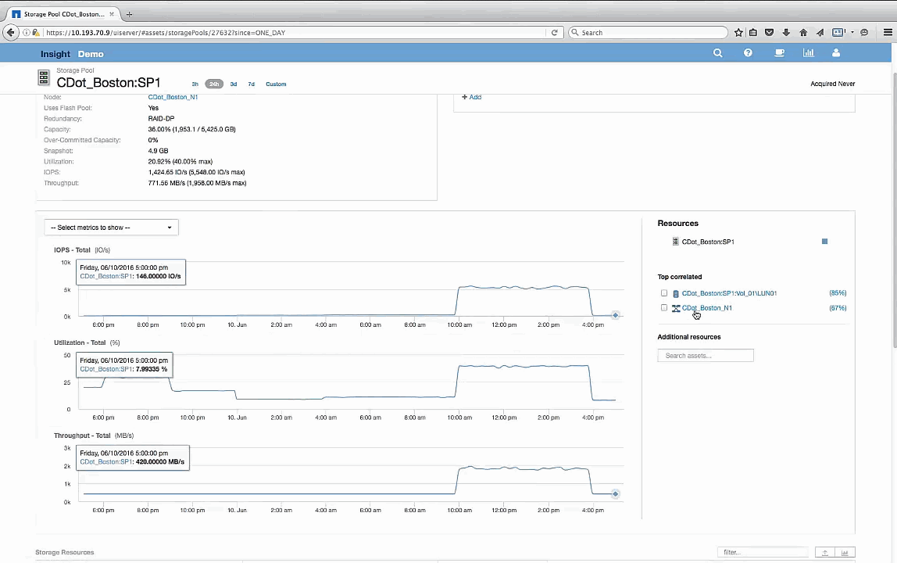

= Examine o pool de armazenamento
:allow-uri-read: 
:icons: font
:imagesdir: ../media/

[role="lead"]
Examinar a página inicial do pool de armazenamento mostra o mesmo pico de IOPS visto em seus ativos correlacionados. Na seção recursos, você pode ver que essa página inicial do pool de armazenamento vincula ao volume do aplicativo de viagem. Clique no volume para abrir a página inicial do volume.

