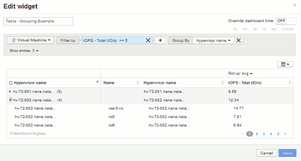

= Exemplo de agrupamento (com rollup explicado)
:allow-uri-read: 
:icons: font
:imagesdir: ../media/

[role="lead"]
Os widgets da tabela permitem agrupar dados para facilitar a exibição.

== Sobre esta tarefa

Neste exemplo, criaremos um widget de tabela mostrando todas as VMs agrupadas por Data Center.

== Passos

. Crie ou abra um dashboard e adicione um widget *Tabela*.
. Selecione *Virtual Machine* como o tipo de ativo para este widget.
. Clique no Seletor de coluna image:../media/column-picker-button.gif[""]e escolha _Nome do hipervisor_ e _IOPS - Total_.
+
Essas colunas são agora exibidas na tabela.

. Vamos ignorar qualquer VM sem IOPS e incluir apenas VMs com IOPS total superior a 1. Clique no botão *Filtrar por* e selecione *IOPS - Total*. Clique em *any* e, no campo *From*, digite 1. Deixe o campo *to* vazio. Clique no botão de verificação para aplicar o filtro.
+
A tabela agora mostra todas as VMs com IOPS total maior ou igual a 1. Observe que não há agrupamento na tabela. Todas as VMs são mostradas.

. Glick o botão *Grupo por*.
+
Como *All* é selecionado como o método de agrupamento por padrão, todas as VMs são movidas para um único grupo chamado "'all'".

. Acima da coluna _IOPS - Total_ agora é uma opção *Roll up*. O método de rolagem padrão é _AVG_. Isso significa que o número mostrado para o grupo é a média de todo o total de IOPS relatado para cada VM dentro do grupo. Você pode optar por rolar essa coluna por _AVG_, _sum_, _min_ ou _Max_. Cada coluna exibida que contém métricas de desempenho pode ser agrupada individualmente.
. Clique em *All* e selecione *Hypervisor name*.
+
A lista de VM agora é agrupada por Hypervisor. É possível expandir cada hipervisor para visualizar as VMs hospedadas por ele.

+

. Clique em *Salvar* para salvar a tabela no painel. Você pode redimensionar o widget.
. Clique em *Salvar* para salvar o painel.

