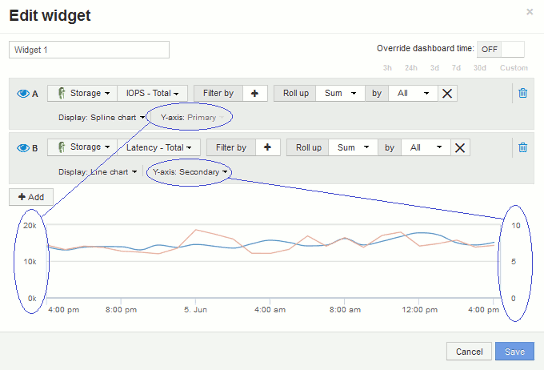

= Explicação dos eixos primário e secundário
:allow-uri-read: 
:icons: font
:imagesdir: ../media/

[role="lead"]
O eixo secundário facilita a visualização de dados de dois conjuntos diferentes de valores que usam diferentes unidades de medida.

== Sobre esta tarefa

Diferentes métricas usam diferentes unidades de medidas para os dados que relatam em um gráfico. Por exemplo, quando se olha para IOPS, a unidade de medida é o número de operações de e/S por segundo de tempo (e/S), enquanto a latência é puramente uma medida de tempo (milissegundos, microssegundos, segundos, etc.). Ao mapear ambas as métricas em um gráfico de linha única usando um único conjunto de valores a para o eixo Y, os números de latência (normalmente um punhado de milissegundos) são mapeados na mesma escala com o IOPS (normalmente numerando nos milhares), e a linha de latência se perde nessa escala.

Mas é possível traçar ambos os conjuntos de dados em um único gráfico significativo, definindo uma unidade de medida no eixo Y primário (lado esquerdo) e a outra unidade de medida no eixo Y secundário (lado direito). Cada métrica é mapeada em sua própria escala.

== Passos

. Crie ou abra um painel. Adicione um widget *gráfico de linha*, *gráfico de spline*, *gráfico de área* ou *gráfico de área empilhada* ao painel.
. Selecione um tipo de ativo (por exemplo, *Storage*) e escolha *IOPS - Total* para sua primeira métrica. Defina os filtros que você quiser e escolha um método de roll-up, se desejado.
+
A linha IOPS é exibida no gráfico, com sua escala mostrada à esquerda.

. Clique em Adicionar* para adicionar uma segunda linha ao gráfico. Para esta linha, escolha *latência - total* para a métrica.
+
Observe que a linha é exibida na parte inferior do gráfico. Isso ocorre porque ele está sendo desenhado na mesma escala que a linha IOPS.

. Na consulta de latência, selecione *eixo Y: Secundário*.
+
A linha de latência agora é desenhada em sua própria escala, que é exibida no lado direito do gráfico.

+

