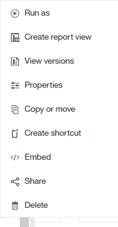
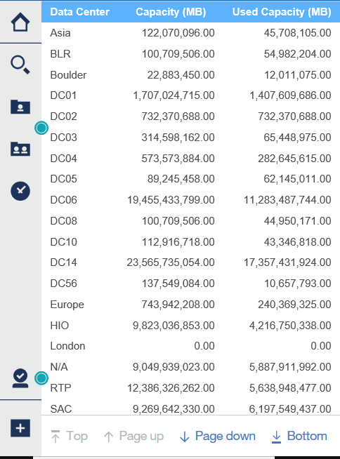

= Criando um relatório usando o Cognos 11
:allow-uri-read: 
:icons: font
:imagesdir: ../media/

[role="lead"]
A criação de relatórios com o Cognos 11 difere das versões anteriores do Cognos. Use este procedimento para criar um relatório usando os relatórios OnCommand Insight predefinidos.

== Sobre esta tarefa

Siga as etapas a seguir para gerar um relatório simples sobre a capacidade física de pools de armazenamento e armazenamento em vários data centers.

== Passos

. Na barra de ferramentas, clique em image:../media/new-report.gif[""]
. Clique em *Relatório*
. Clique em *Templates* > *blank*
. Clique em *Themes* > *Cool Blue* > *OK*
+
As guias fonte e dados são exibidas

. Clique em *Source* >image:../media/new-report.gif[""] *
. Na caixa de diálogo abrir arquivo, clique em *conteúdo da equipe* > *Pacotes*
+
É apresentada uma lista de pacotes disponíveis.

. Clique em *capacidade do pool de armazenamento e armazenamento* > *abrir*
. Clique em image:../media/new-report.gif[""]
+
Os estilos disponíveis para o seu relatório são exibidos.

. Clique em *Lista*
+
Adicione nomes apropriados para Lista e consulta

. Clique em *OK*
. Expanda *capacidade física*
. Expanda para o nível mais baixo de *Data Center*
. Arraste image:../media/data-center.gif[""] para o Palato de relatórios.
. Expandir *capacidade (MB)*
. Arraste *Capacity (MB)* para o Palato de relatórios.
. Arraste *Used Capacity (MB)* para o Reporting Palate.
. Execute o relatório clicando  e selecionando um tipo de saída.

== Resultados

É criado um relatório semelhante ao seguinte:

