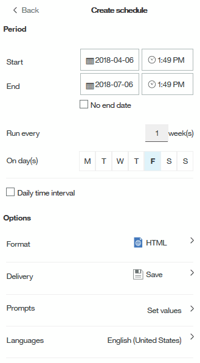

= Personalizar o formato de saída e a entrega de um relatório
:allow-uri-read: 
:icons: font
:imagesdir: ../media/

[role="lead"]
Você pode personalizar o formato e o método de entrega dos relatórios.

== Passos

. Abra o Portal de relatórios do OnCommand Insight e selecione o relatório que deseja personalizar e clique em *[...]*.
+
image::../media/run-report.gif[executar relatório]

. Clique em *Propriedades* > *Programação*
+

. Pode definir as seguintes opções:
+
** *Agendar* quando quiser que os relatórios sejam executados.
** *Formatar* a saída do relatório.
** *Entrega* imprima, salve ou envie um e-mail para o relatório.
** *Idiomas* definem o idioma em que o relatório é entregue.

. Clique em *criar* para produzir o relatório usando as seleções feitas.

